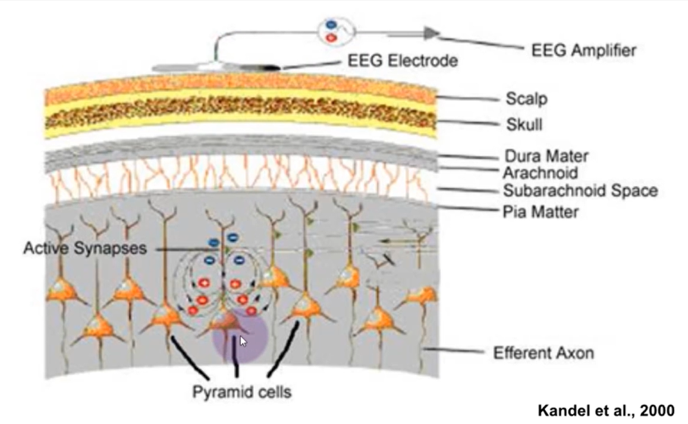

# What are EEG (Electroencephalogram) Signals

When neuron in the brain become active there is a flow of ions that creates a spatial asymmetry resulting from ions going into and out of the neuron. This creates a charge. The signals from the neurons with many of them firing simultaneously can get strong enough to pass through brain tissue, skull to be measured by an electrode (wet or dry) placed on the skull. Hence EEG signals are the voltage potential of all neurons firing  synchronously at a specific location in the brain.

When looking at these signals we are interested in extracting features out of the time dimension (to predict some occurrence) and also the spatial dimension i.e. which part of the brain the signal is coming from. 

Before we can use the EEG signals for analysis, we need to separate true sources from latent constructs (noise). The technique that was used to filter unnecessary signals in SEED -IV or DEAP emotion datasets is cognitive source separation. The experiments are designed in such a way that we elicit the required feelings while watching some videos. Marker can be placed to synchronize events with cognitive activity

## What EEG data looks like:

The following display shows EEG data from 62 electrodes placed on the brain following the standard 10/20 system:

 
*Mike Cohen, 2018*

The voltage deflection of the population of neurons in different parts of the brain are shown above. Information that is being processed in the brain manifests as the voltage fluctuations in the EEG signal. 
 
## Channels in the EEG signals:

10/20 system is an internationally recognized method to describe the location of scalp electrodes. The signals from each of these channels are gathered during the EEG test. The numbers ‘10’ and ‘20’ refer to the fact that the distances between adjacent electrodes are either 10% or 20% of the total front-back or right-left distance of the skull. Each site/channel has a letter to identify the lobe, F (Frontal), T(Temporal), C (Central-only for identification as there is no central lobe), P (Parietal) and O (Occipital) and a number to identify the hemisphere location. The ‘z’ (zero) refers to an electrode placed on the mid line. Even numbers (2,4,6,8) refer to electrode positions on the right hemisphere and odd numbers (1,3,5,7) refer to electrode positions on the left hemisphere.

*Trans Cranial Technologies (2012)*

     
## Preprocessing steps used:
•	Using a high pass filter (e.g. .5 HZ)
•	Import channel locations
•	Epoch data around important events. 3 dimensions - time, channels, epochs/trial
•	Subtract pre-stimulus baseline. Avg signal data from each channel before events and subtract from epoch data. Also helps adjust scale.
•	Adjust marker values (when specific event happened)
•	Average reference EEG channels. e.g zero electrodes. Using from one side of the head introduces bias. 
•	Run ICA to clean data.
Since pre-processing of EEG data needs expertise in EEG signals and understanding on the experimental setup I have relied on the publishers for this step. ICA can help remove eye blink data without removing the channel. 

# References:
Trans Cranial Technologies (2012). 10/20 System Positioning MANUAL. Retrieved from http://chgd.umich.edu/wp-content/uploads/2014/06/10-20_system_positioning.pdf
Cohen, Mike (2018) Udemy course. Complete neural signal processing and analysis: Zero to Hero
